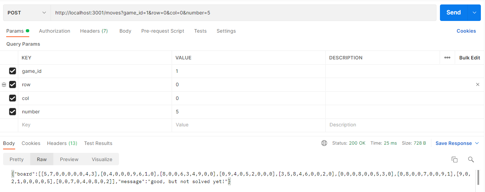

# Saeko Challenge - Ruby on Rails Project

This project was part of a process at Saeko.
This challenge is to create an API to handle a Sudoku Game.

## Solution

## Live demo link

[try the live demo link](https://sudoku-api-atf.herokuapp.com/)

## Video Description

[try the video link](https://youtu.be/aYJDUpPX-Hc)

### Formats of the entries in the endpoints

game_id: integer - Example: `1`

You can choose from 1 - 4. There are 4 boards preloaded in the database seed.

### 1. End Point - get `'/game/:game_id'`

### 2. End Point - post `'/moves'`

`move_params : {`

`game_id: integer, from 0-4 (4 existing games)`

`row: integer, from 0-8`

`col: integer, from 0-8`

`number: integer from 0-9`

`}`

### Rules

The rules for the game are the following:

- The player cannot change the value of a cell that was initialized by the game.

- The player must only input a value between 1 and 9, or an empty value to clear the cell.

- When the player inputs a value that breaks any Sudoku rule, the API must not persist the value, and respond with a 4xx request.

- When the player inputs the last missing value, the game must close and no other changes must be allowed.

### Sudoku Rules:

- No row contains more than one of the same number from 1 to 9

- No column contains more than one of the same number from 1 to 9

- No 3×3 grid contains more than one of the same number from 1 to 9

## Built and tested with

- Ruby 2.7.4
- Ruby on Rails 6.1.4.1
- Postgres: >=9.5
- Rspec 5.0
- Capybara
- Shoulda Matchers

## Setup to use it in a local environment

Download the repo with this command

`git clone https://github.com/alejandrotoledoweb/sudoku-game-api.git`

`git checkout feature-game`

`cd sudoku-game-api`

Install the Gems and Dependencies

`bundle install`

Migrate the database and models, create the seed information

`rails db:create`

`rails db:migrate`

`rails db:seed`

## For the usage

Run the server

`rails server`

Open in the browser `http://localhost:3001/`

## To test

to run the test run this command:

`bundle exec rspec`

## Author

👤 **Alejandro Toledo**

- GitHub: [@alejandrotoledoweb](https://github.com/alejandrotoledoweb)
- Twitter: [@alejot](https://twitter.com/alejot)
- LinkedIn: [Alejandro Toledo](https://www.linkedin.com/in/alejandro-toledo-3b444b109/)

## 🤝 Contributing

Contributions, issues and feature requests are welcome!

Feel free to check the [issues page](https://github.com/alejandrotoledoweb/sudoku-game-api/issues).

## Show your support

Give a ⭐️ if you like this project!

## Acknowledgments

- Project inspired and challenged by Saeko.

## 📝 License

This project is [MIT](https://opensource.org/licenses/MIT) licensed.
